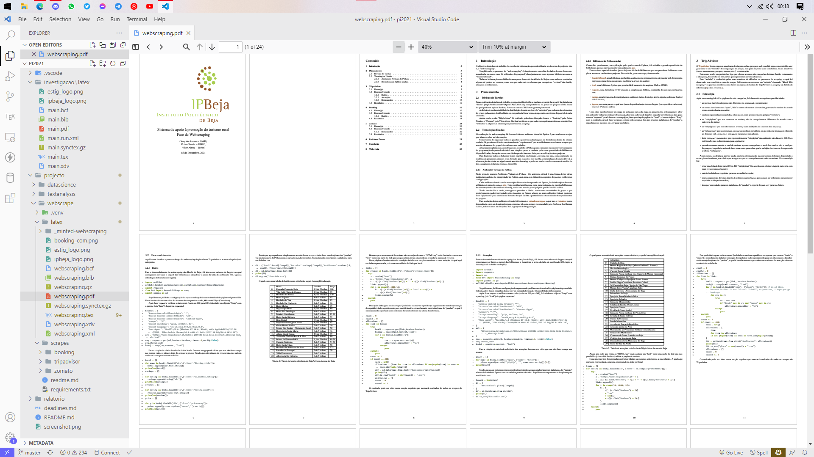

# Projecto avaliação da disciplina de Projecto Integrado ano lectivo 2021/2022

Projecto integrado é uma disciplina do meu curso de engenharia informtica que visa aplicar conteudo de disciplinas anteriores e trabalho de grupo.

## Descrição

Analise de dados de plataformas turisticas de clientes portugueses. De forma a tentar auxiliar, atraves da analise, o turismo rural e em especial do baixo alentejo, em beja.

## Ilustração

